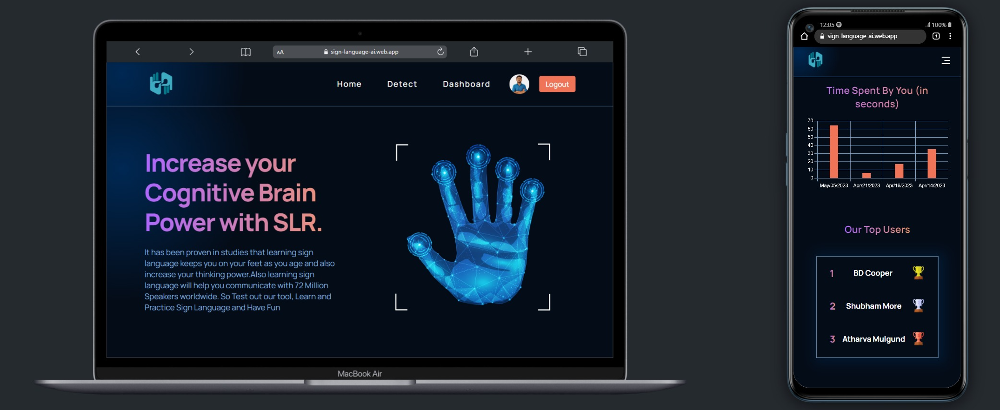

<<<<<<< HEAD
# BridgeTechies
Team Leader : Het Patel 
Team Members : Jaimin Modi 
               Mitra Monik
               Tejas Patel
                           

# Sign Language Translator Frontend

---

## Pages and Features

### 1. Translator

Translate bidirectionally between various text and sign languages using a variety of AI models.

### 2. Learn

Train yourself to use this tool or teach hearing-impaired students quality lessons.

#### 2.1 Walkthrough

Start a step by step walkthrough on which components to click or watch a video tutorial.

#### 2.2 Courses

Interactive lessons in sign language videos, text & audio.

### 3. Documentation

Preview of the python library's documentation & research papers.
=======
# *Sign Language Recognition for Deaf and Dumb*

- Our sign language recognition project involved creating a custom dataset, preprocessing images, training a model, integrating with React, and hosting with Firebase. 

- The result is a real-time sign language recognition application that recognizes a variety of sign language gestures.

- Our Model is trained for 26 alphabets and 16 words of ASL and which are commonly used in general communication.

## Features

- Real-Time Recognition

- Easy-to-Use Interface

- Adaptive Learning

- High Accuracy

- Real Time User Progress Data

## Tech Stack

*Front-end:*

- React
- Redux

*Back-end:*

- Firebase (for hosting, authentication, and storage)

*Machine Learning Framework:*

- MediaPipe

*NPM Packages:*

- @mediapipe/drawing_utils
- @mediapipe/hands
- @mediapipe/tasks-vision
- @redux-devtools/extension
- chart.js
- firebase
- js-cookie
- react-chartjs-2
- react-icons
- react-redux
- react-router-dom
- react-toastify
- react-webcam
- redux
- redux-thunk
- uuid

## Team Members

- So this project is a group project done in collaboration with the members mentioned below.

| Name            | Email-id                      |
| :-------------- | :---------------------------- |
| HET PATEL       | het12779@gmail.com      |
| JAIMIN MODI     | jmodi7396@gmail.com      |
| MITRA MONIK     | mitramonik53@gmail.com |
| TEJAS PATEL     | tejasvp2006@gmail.com         |

## Authors

- [@het-patel](https://github.com/hetpatel0312/)
- [@jaimin-modi](https://github.com/jaimin45-art/)
- [@mitra-monik](https://github.com/monik18-art/)
- [@tejas-patel](https://github.com/TheFreelancer1)

## Acknowledgements

- [React](https://react.dev/)
- [mediapipe](https://developers.google.com/mediapipe)
- [Firebase](https://firebase.google.com/)
